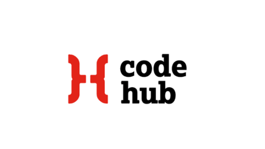

# Golang for Beginners

 

This repository contains source code to accompany the "Golang for Beginners" workshop hosted by [CodeHub](https://www.codehub.org.uk/)@[Workhop Wednesdays](https://www.meetup.com/codehub-bristol/).

## Target audience
This repository is aimed at beginners with the goal to educate and, hopefully, kickstart a life-long interest in the field of computer science and programming. 

## How to run the code examples
In order to run the example code, you'll need `go` installed on your computer.

Follow the instuctions on the [official go website](https://go.dev/) on how to download and install the binaries on your operating system.

Once you have the binaries installed, clone this repository and run the example code from within the lesson's directory.

For example, to run lesson `01`:
```console
$ git clone https://github.com/CodeHubOrg/golang-for-beginners.git
$ cd golang-for-beginners
$ cd 01
$ go run main.go
```

## Content
By running the provided examples you'll be able to generate an arbitrary length of text in the style of various authors, including William Shakespeare, Lewis Caroll and E. M. Forster.

## Methodology
We'll employ the idea of [Markov chains](https://en.wikipedia.org/wiki/Markov_chain) to analyse a sample text, based on which we'll produce new content. By running the algorithm on the aforementioned authors' books, now in the public domain, we can recognise pattern probabilities unique to their individual writing style and, as such, the generated text will follow the same stylistic probabilities.

While this may sound somewhat daunting for a beginner, the core idea is extremely simple and can be expressed in no more than 30 lines of code. 

The provided examples are excessively documented with inline comments to ensure each step of the algorithm is clear and easy to understand.

The program code aims to promote educational purposes and may not follow security or performence best practices in favour of readability and clarity.

Happy coding!
